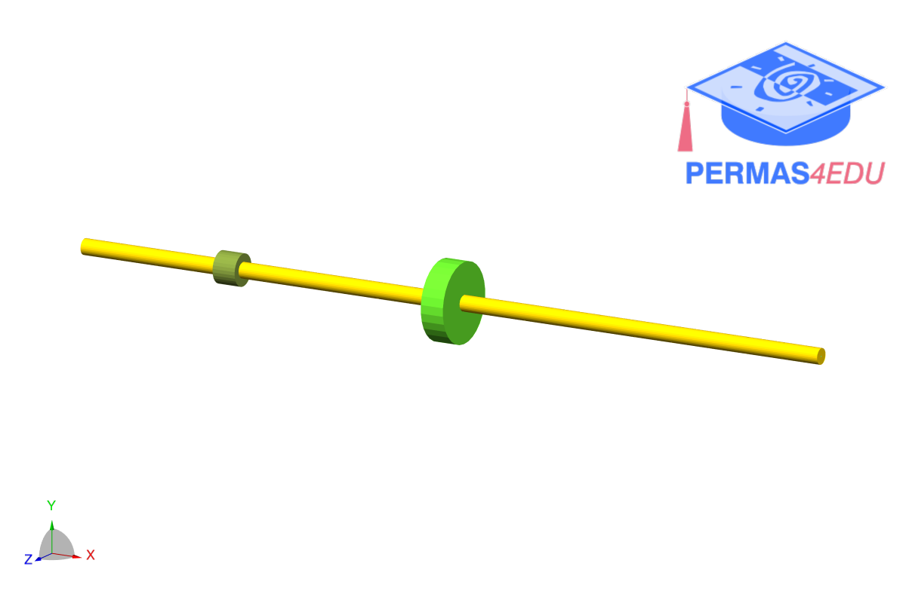

***
[⬅️](../0053/README.md "Previous example")
[➡️](../README.md "Go up one directory")
***

The example is adapted from [Bayesian Inference for Crack Identification in Rotating Shafts](https://doi.org/10.1016/j.euromechsol.2026.106239)

