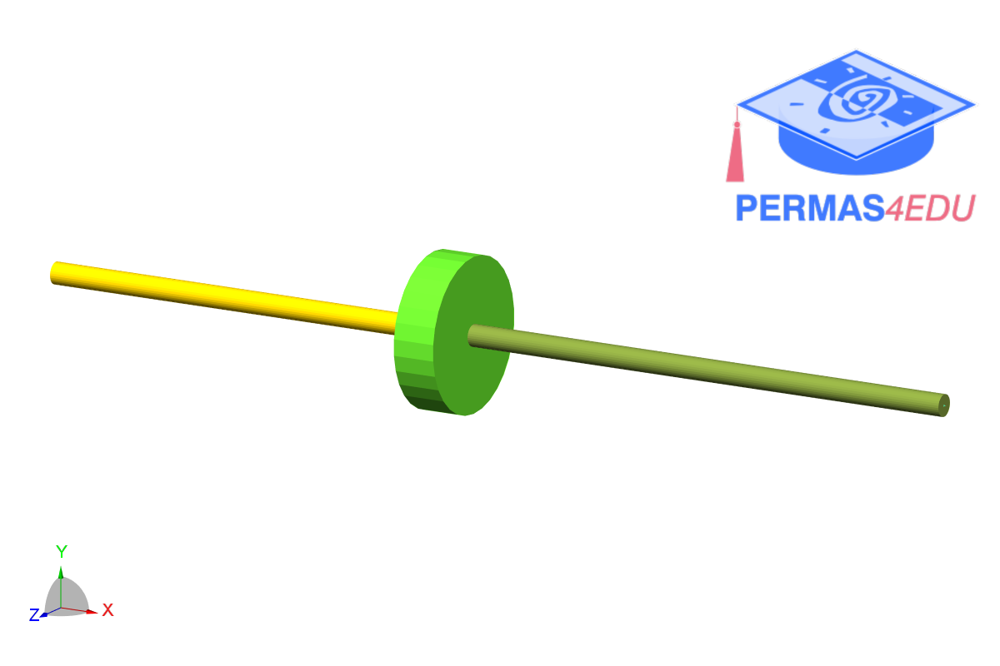

***
[⬅️](../0059/README.md "Previous example")
[➡️](../README.md "Go up one directory")
***
The example is adapted from [Modal Analysis of Rotor System Using Line Body Elements in ANSYS Workbench](https://doi.org/10.38124/ijisrt/26aug219)

