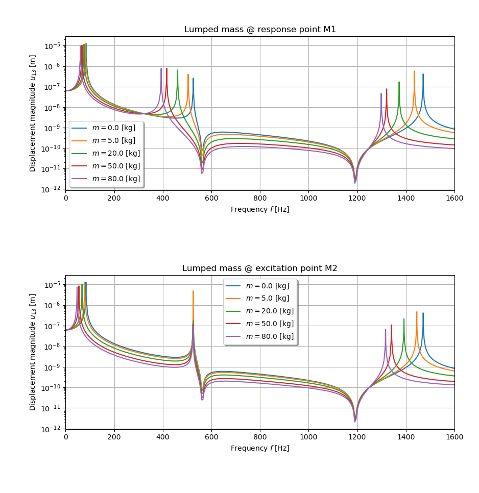

***
[⬅️](../002/README.md "Previous example")
[➡️](../004/README.md "Next example")
***

The example is taken from [Prediction for Antiresonant and Extremum Response Frequencies of Undamped Structures](https://doi.org/10.2514/1.J063011)

A sampling procedure is used for the parametric study.

