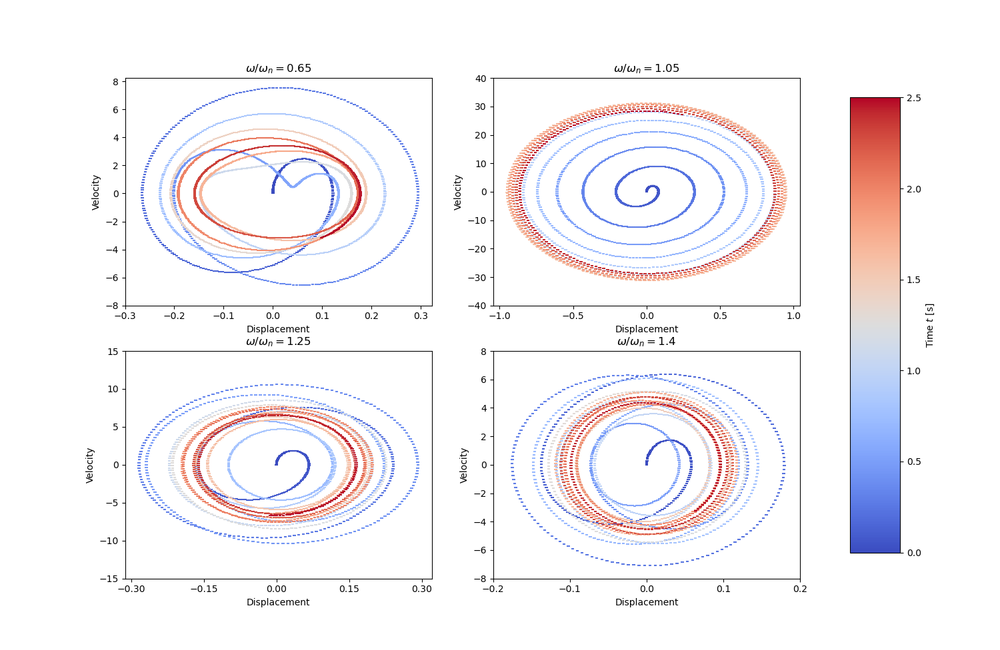
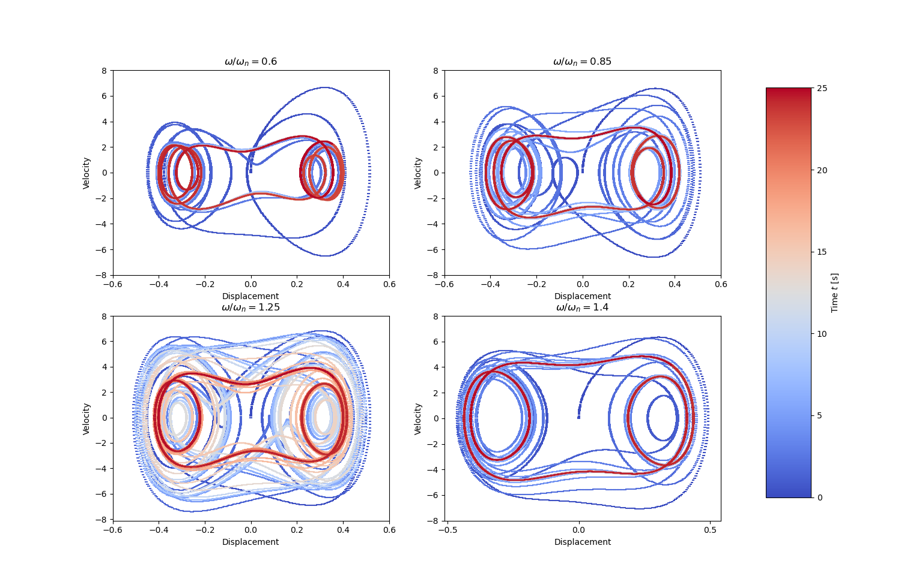
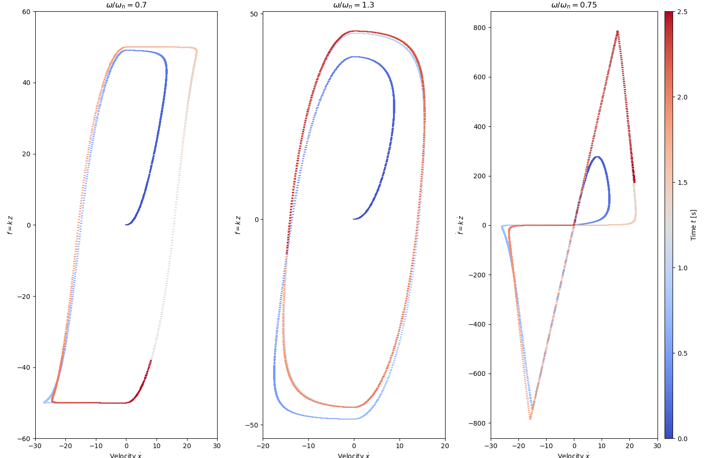
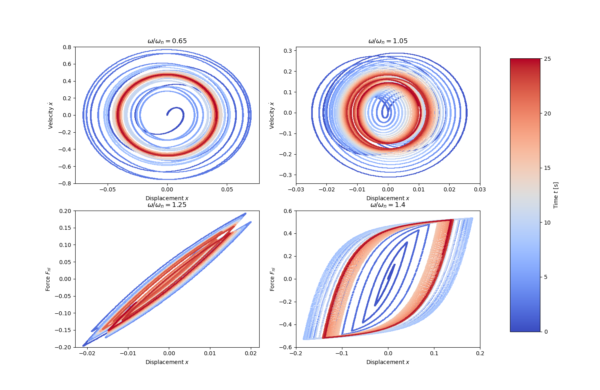

The examples are taken from [Sparse Bayesian machine learning for the interpretable identification of nonlinear structural dynamics: Towards the experimental data-driven discovery of a quasi zero stiffness device](https://doi.org/10.1016/j.ymssp.2023.110858)

