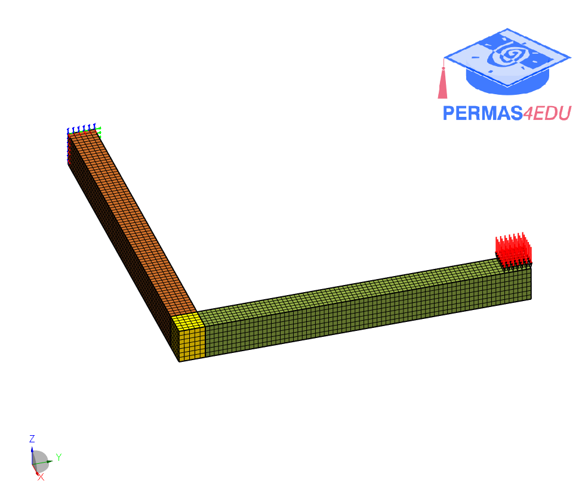

***
[⬅️](../005/README.md "Previous example")
[➡️](../007/README.md "Next example")
***

The example is adapted from [A digital twin framework for civil engineering structures](https://doi.org/10.1016/j.cma.2023.116584)

