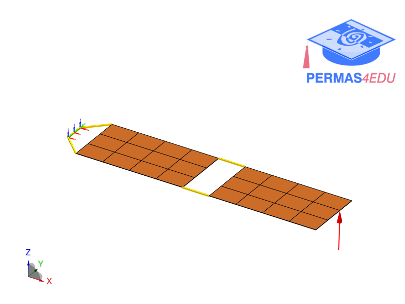
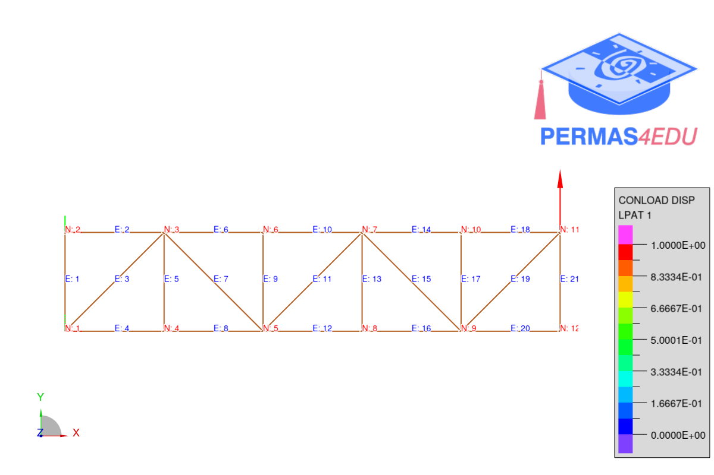

***
[⬅️](../013/README.md "Previous example")
[➡️](../015/README.md "Next example")
***

The example is adapted from [Sensitivity analysis of frequency response functions with imaginary parts decoupling based on multicomplex-step perturbation](https://doi.org/10.1016/j.apm.2024.115669)

