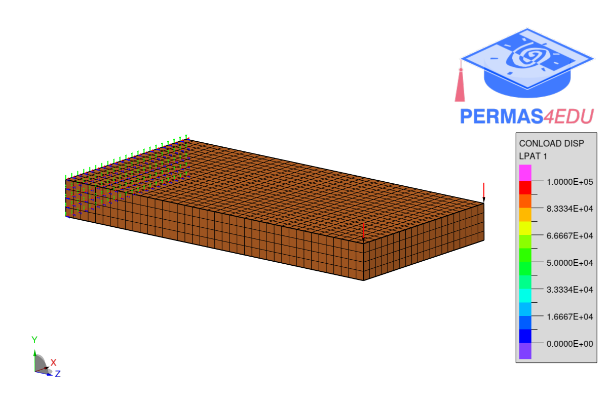
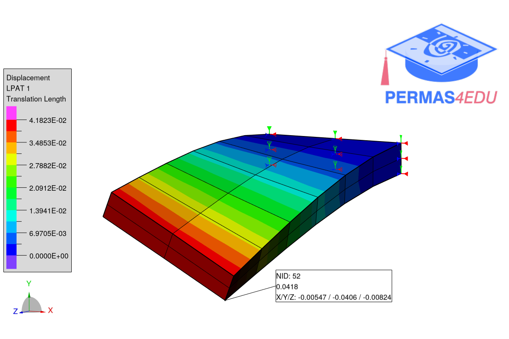

The example is adapted from [Elastodynamic Analysis of Rotating Solids by Novel Nodal Position Finite Element Method](https://doi.org/10.1016/j.euromechsol.2024.105478)

Thanks to Qi Zhang for sharing the Ansys model. His support is greatly appreciated.

