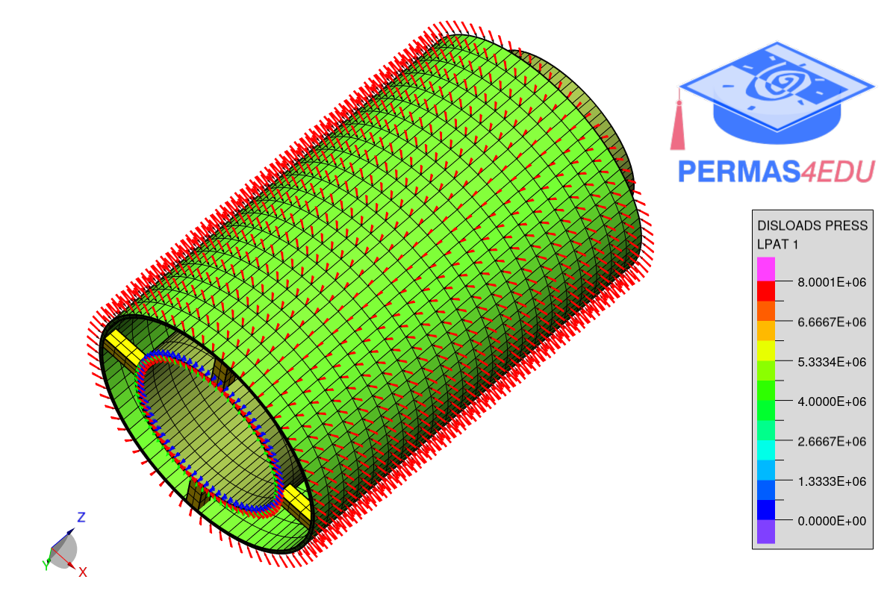
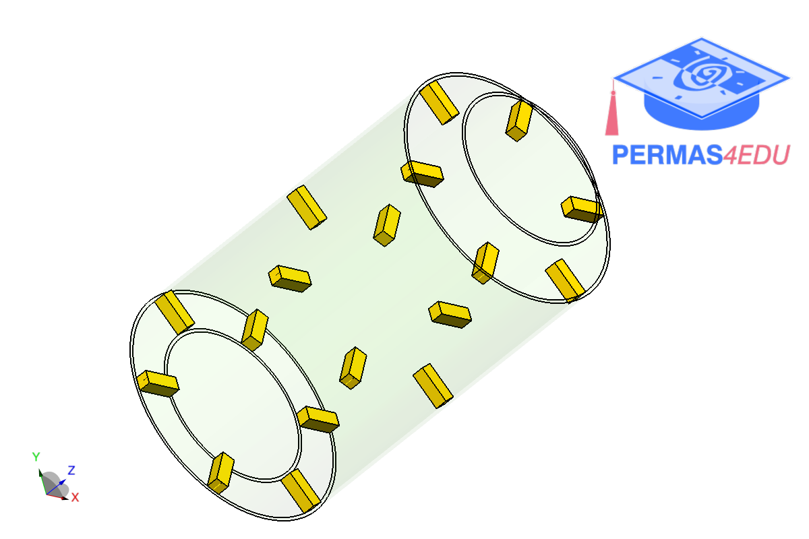

The example is adapated from [Sequential sensor placement for damage detection under frequency-domain dynamics](https://doi.org/10.1016/j.finel.2025.104315)

### Two cylinders: 8 connections

### Two cylinders: 18 connections

