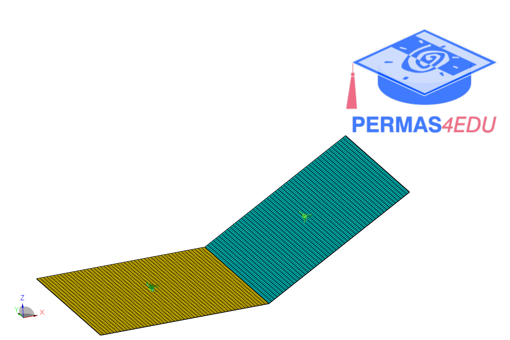
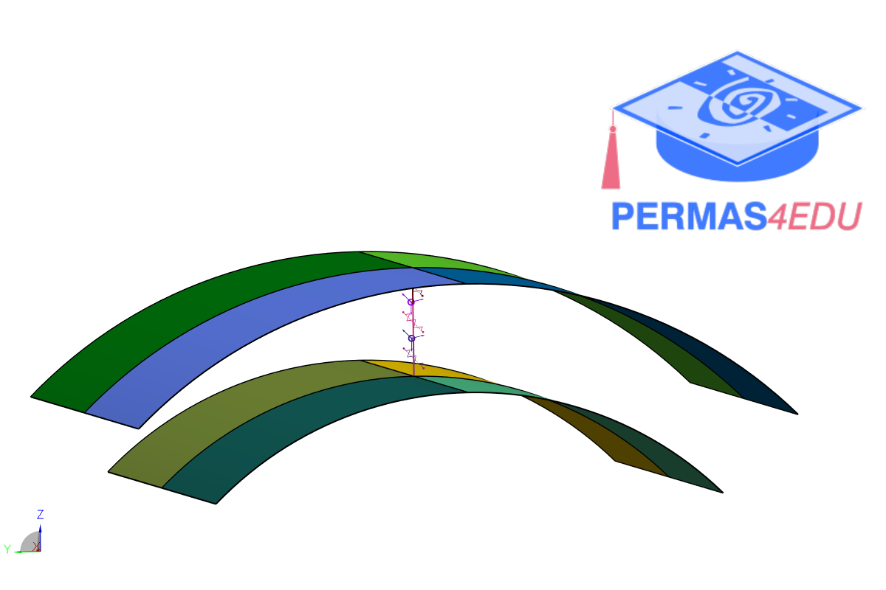
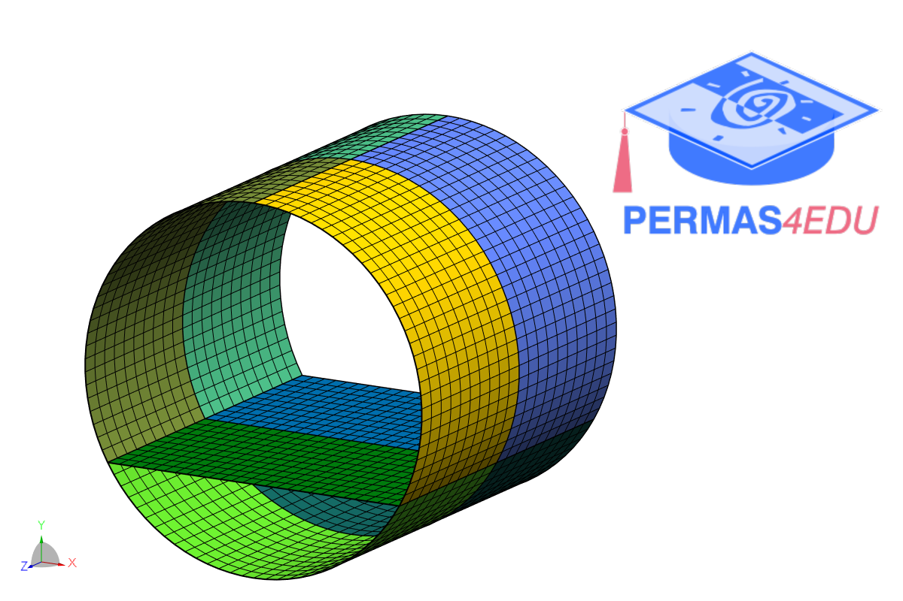

The example is adapted from [Unified vibration modeling of shell and plate structures with resonators](https://doi.org/10.1016/j.ijmecsci.2025.109921)

### L-shaped plate

### Open cylinders with Type 4 resonators

### Coupled shell-plate structure

