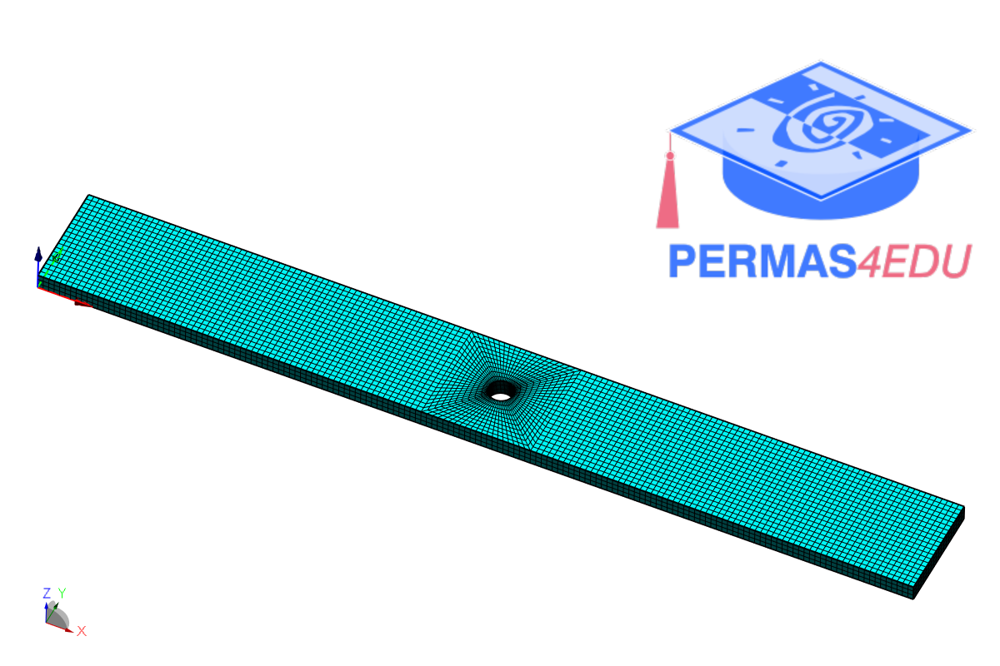

***
[⬅️](../028/README.md "Previous example")
[➡️](../030/README.md "Next example")
***

The example is adapted from [Separation and quantification of damage-induced and non-damage-induced vibro-acoustic modulation and the problem of contrary modulations](https://doi.org/10.1016/j.ymssp.2025.112708)

