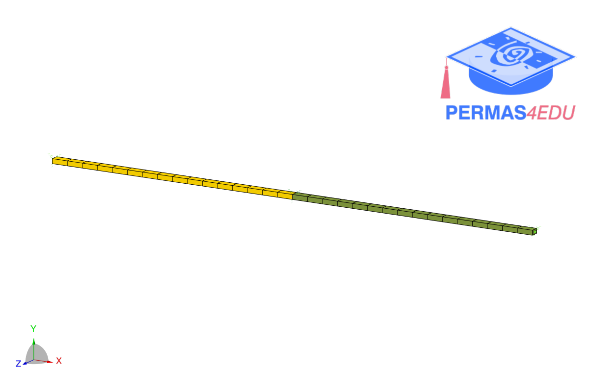

***
[⬅️](../030/README.md "Previous example")
[➡️](../032/README.md "Next example")
***
The example is adapted from [Joint load-parameter-response identification using a physics-encoded neural network](https://doi.org/10.1016/j.ymssp.2025.112597)

