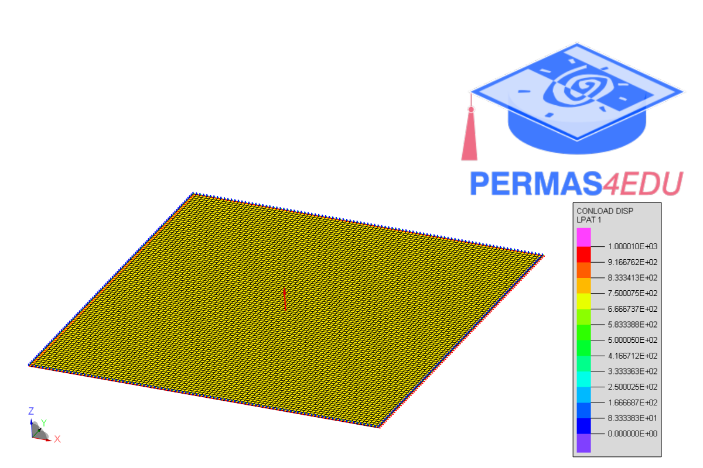
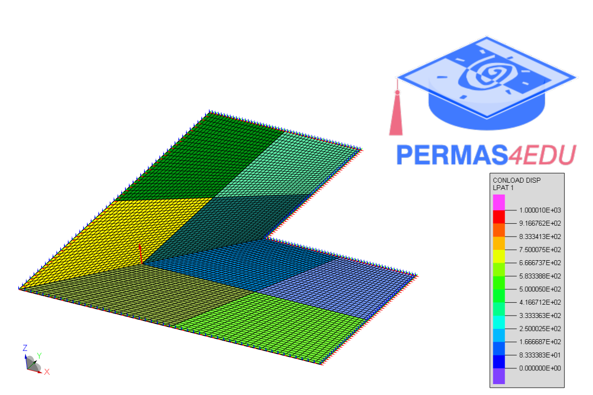

The example is adapted from  [Forced vibration analysis of isogeometric Reissner-Mindlin shells using modal superposition methods](https://doi.org/10.1016/j.tws.2025.113360).

### Simply supported square plate

### L-shaped clamped plate

