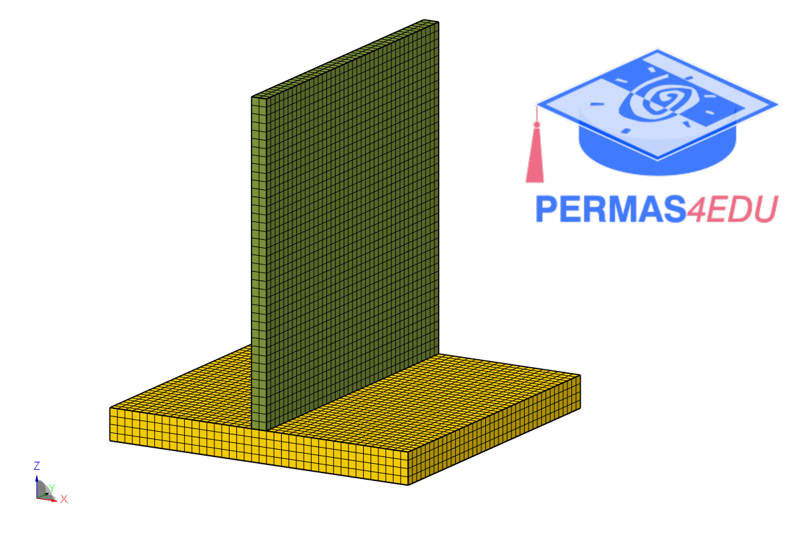

***
[⬅️](../033/README.md "Previous example")
[➡️](../035/README.md "Next example")
***

The example is adapted from a recent [LinkedIn post](https://www.linkedin.com/feed/update/urn:li:activity:7351020649345097728/).

