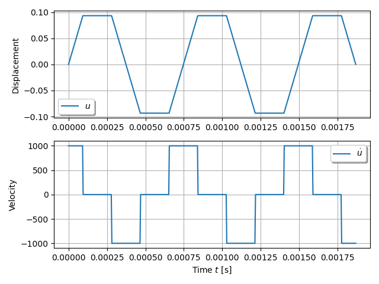

The example is adapted from [An effective reduction method with Caughey damping for spurious oscillations in dynamic problems](https://doi.org/10.1007/s11012-025-02036-9)

$$c=\sqrt{\frac{E}{\rho}},\quad \Delta t = \frac{L_E}{c}$$

