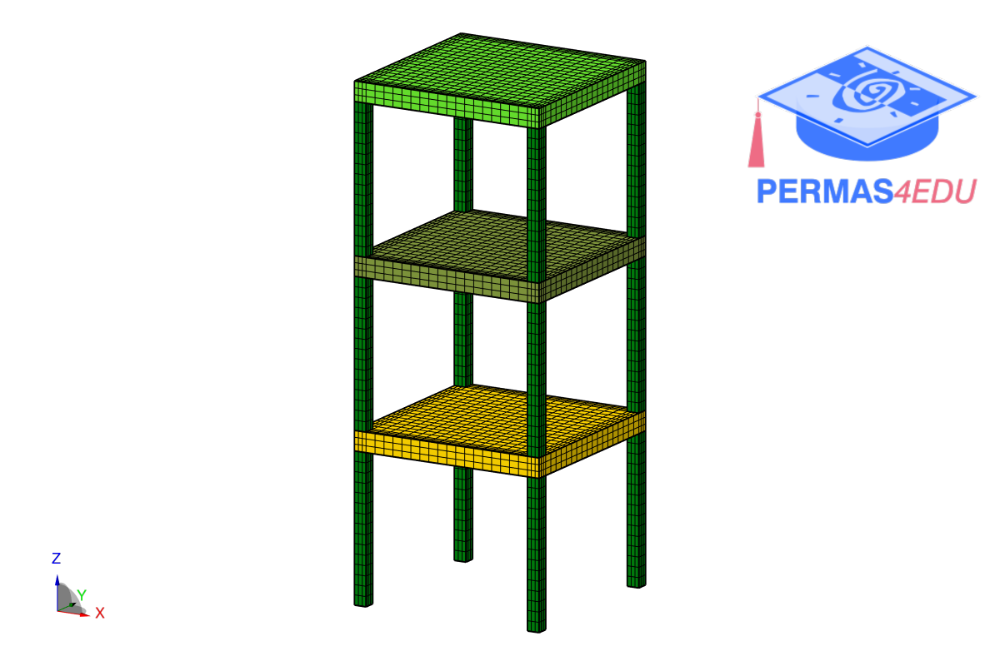

***
[⬅️](../039/README.md "Previous example")
[➡️](../README.md "Go up one directory level")
***

The example is adapted from [A sensitivity-based one-at-a-time estimation of posterior marginal probability distributions in Bayesian model updating](https://doi.org/10.1007/s00419-025-03004-1)

