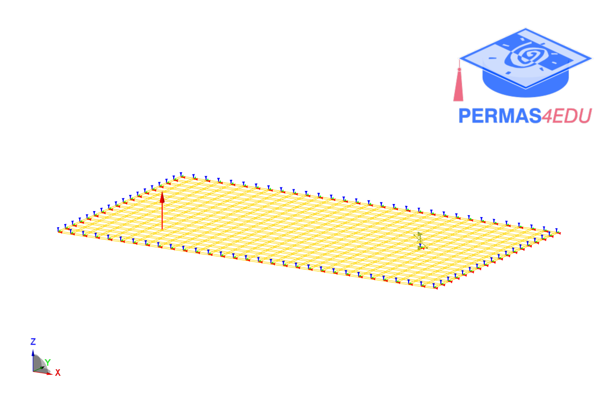

***
[⬅️](../042/README.md "Previous example")
[➡️](../044/README.md "Next example")
***

The example is adapted from [Physics-informed neural operators for predicting structural intensity from laser Doppler vibrometry measurements of plates](https://doi.org/10.1016/j.ymssp.2026.114013)

