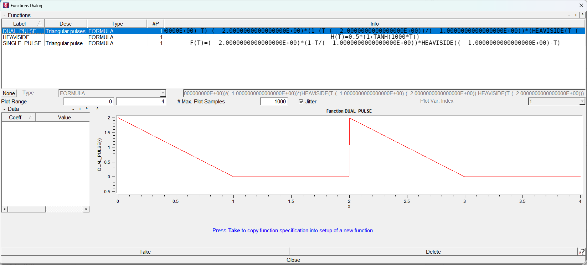
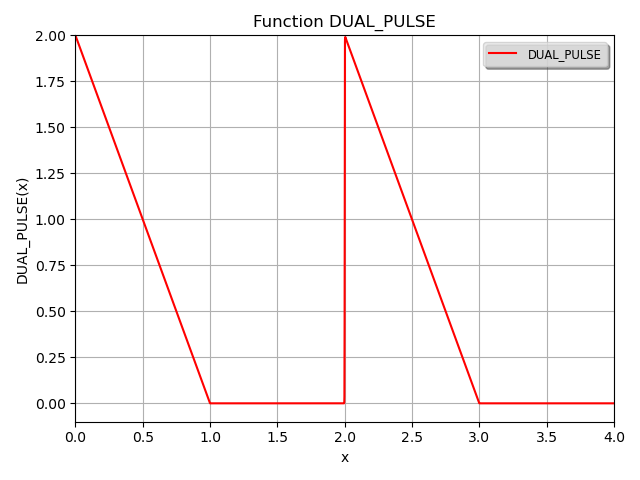

***
[⬅️](../044/README.md "Previous example")
[➡️](../046/README.md "Next example")
***

The example is adapted from [Maximum response of SDOF systems under consecutive triangular pulses](https://doi.org/10.1016/j.jsv.2025.119631)

