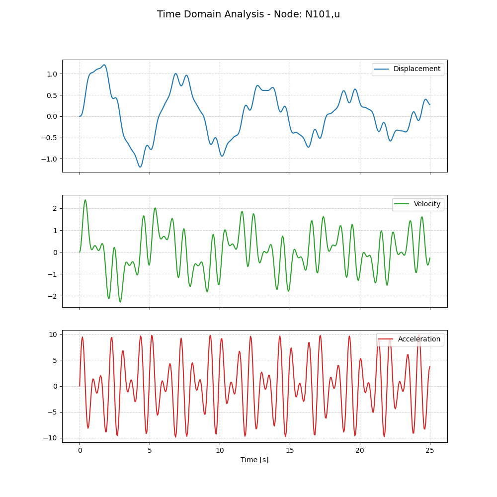
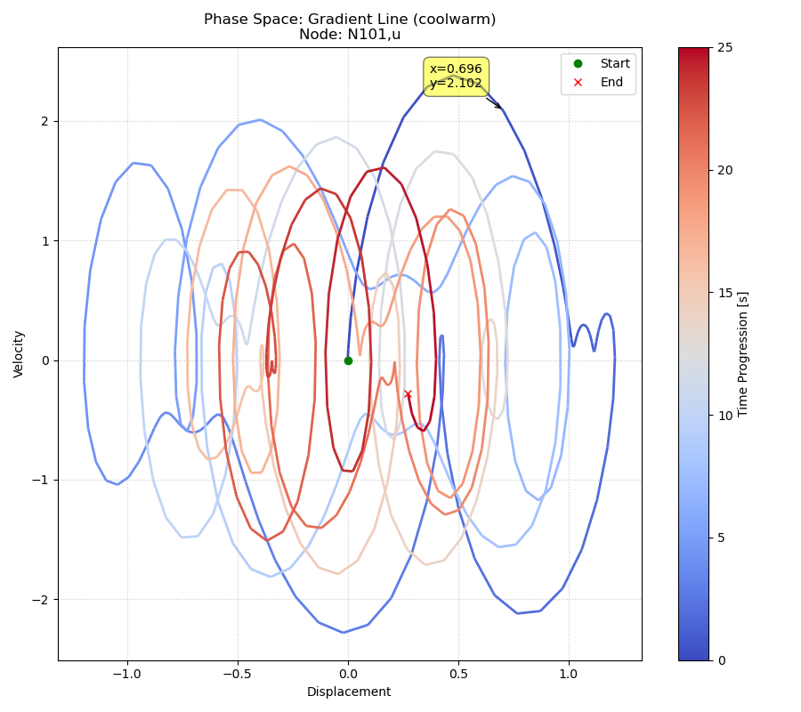

***
[⬅️](../046/README.md "Previous example")
[➡️](../README.md "Go up one directory level")
***

The example is adapted from [A Two-step Discretization Framework Bridging Quasi-Periodic and Periodic Solutions in Nonlinear Dynamics](https://doi.org/10.1016/j.cnsns.2026.109939)

