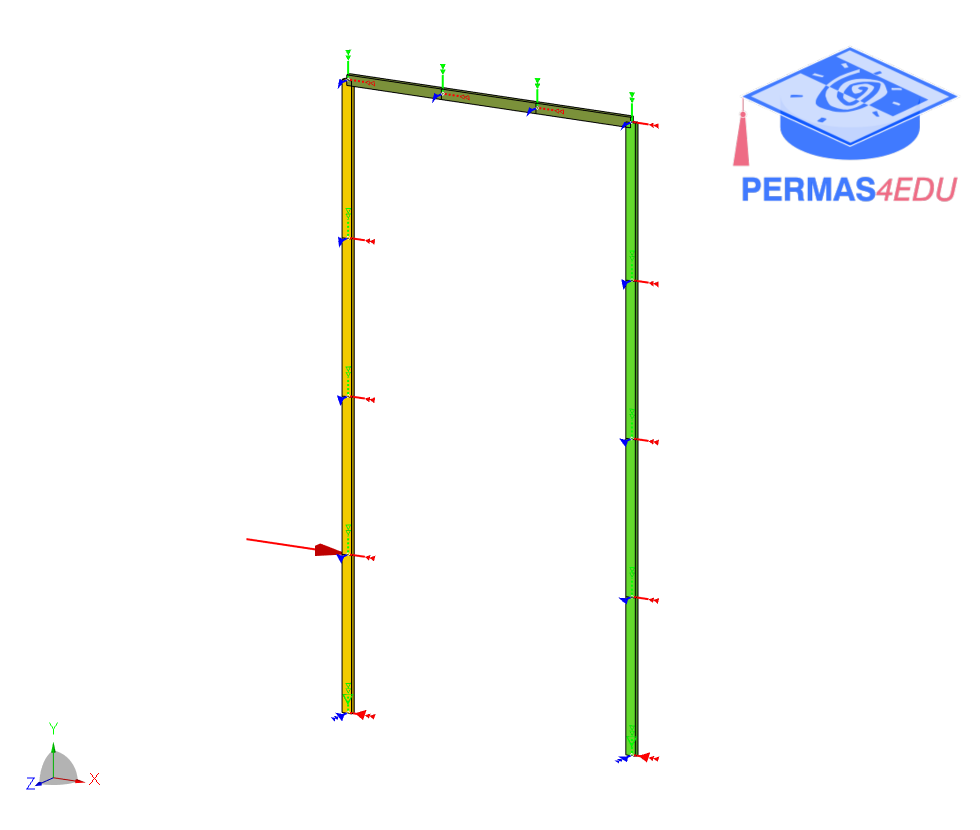

***
[⬅️](../048/README.md "Previous example")
[➡️](../050/README.md "Next example")
***

The example is adapted from [Differentiating damage effects in a structural component from the time response](https://doi.org/10.1016/j.ymssp.2010.04.007)

