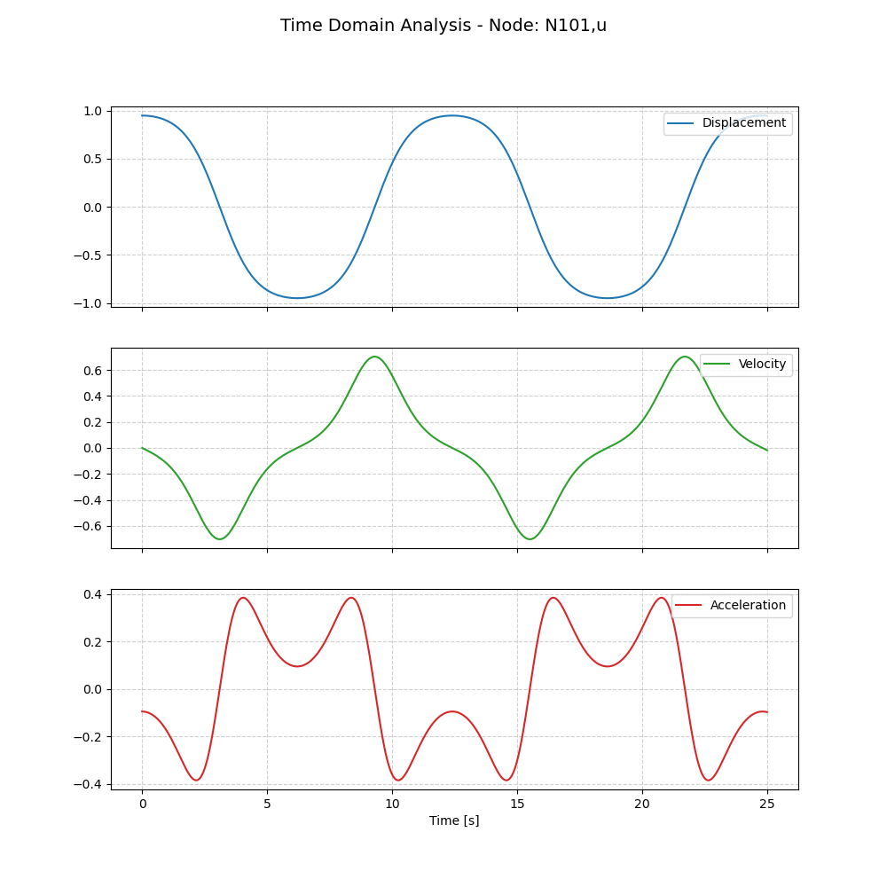
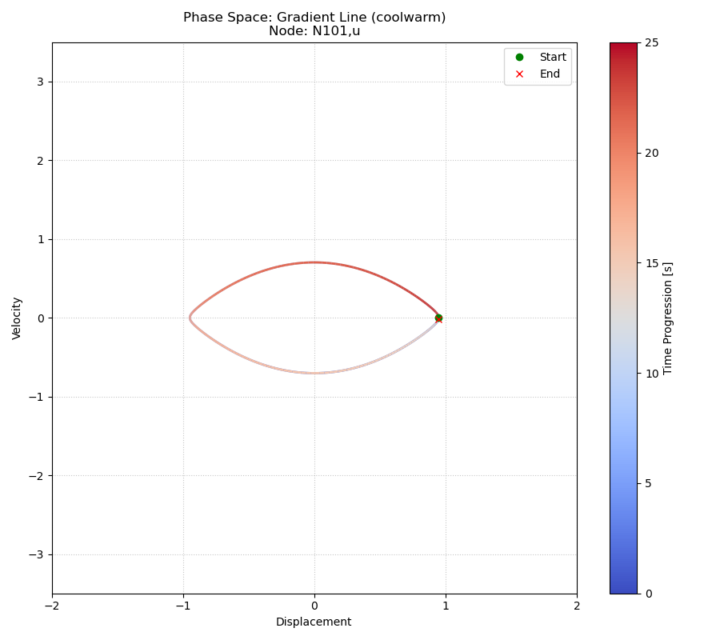

***
[⬅️](../049/README.md "Previous example")
[➡️](../README.md "Go up one directory level")
***

The example is adapted from [Explicit approximate frequency–amplitude relationships for conservative nonlinear oscillators](https://doi.org/10.1016/j.apm.2026.116851)

