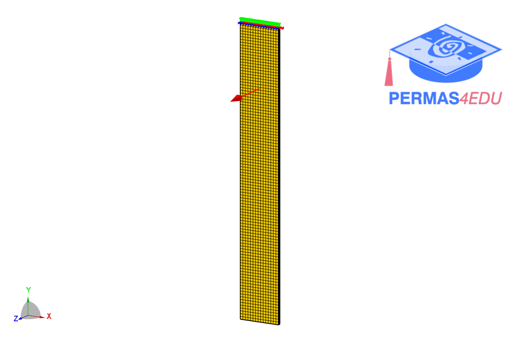

***
[⬅️](../050/README.md "Previous example")
[➡️](../README.md "Go up one directory level")
***
The example is adapted from [Vibration measurement with neuromorphic vision sensors](https://doi.org/10.1016/j.ymssp.2026.114102)

