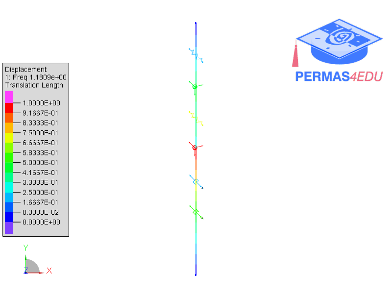
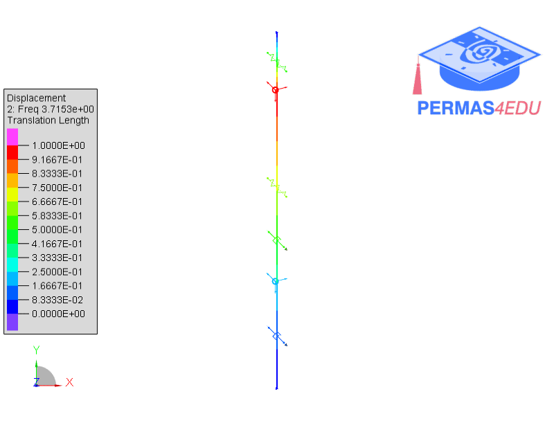

***
[⬅️](../052/README.md "Previous example")
[➡️](../README.md "Go up one directory level")
***
The example is adapted from [Damping ratio measurements of multi-degree-of-freedom systems](https://doi.org/10.59400/sv3752)

### Normal modes

### Free vibration

### Forced vibration
