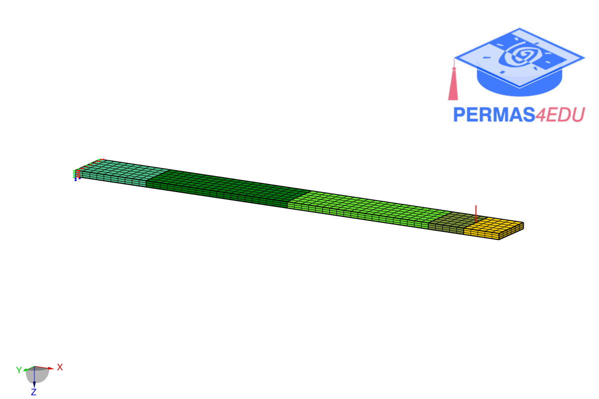

***
[⬅️](../053/README.md "Previous example")
[➡️](../055/README.md "Next example")
***

The  example is adapted from [A domain-correction framework for structural response reconstruction with imperfect FEM and sparse measurements](https://doi.org/10.1016/j.ymssp.2026.114274)

