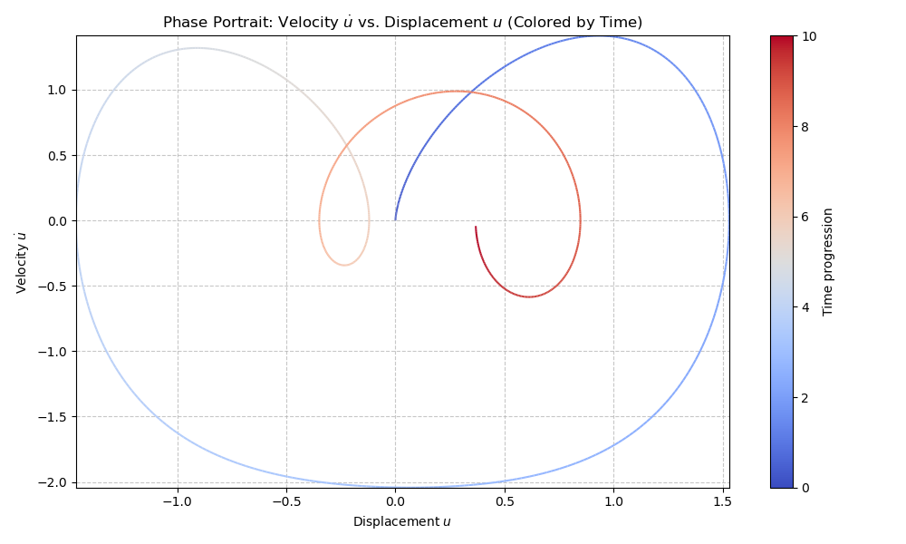

***
[⬅️](../054/README.md "Previous example")
[➡️](../README.md "Go up one directory level")
***

The example is adapted from [Energy-based dual-phased dynamics identification for forced nonlinear vibrations](https://doi.org/10.1016/j.ymssp.2026.114420)

