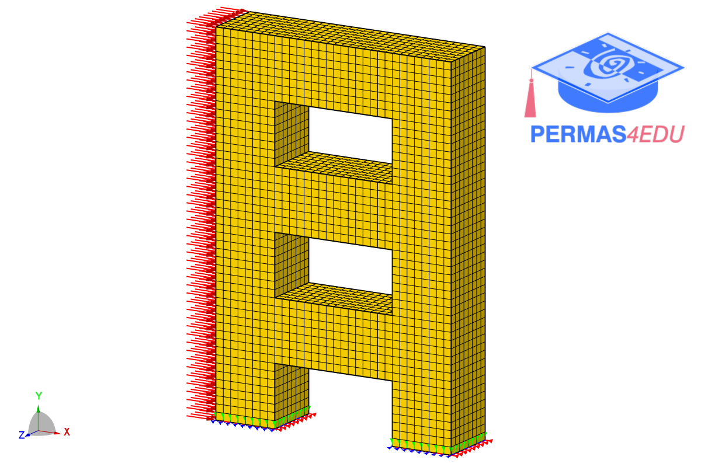

***
[⬅️](../057/README.md "Previous example")
[➡️](../README.md "Go up one directory level")
***
The example is adapted from [A Novel Newmark Family of Fourth-Order Accurate Algorithms with Complex Sub-Steps for Structural Dynamics](https://doi.org/10.3390/dynamics6030024)

