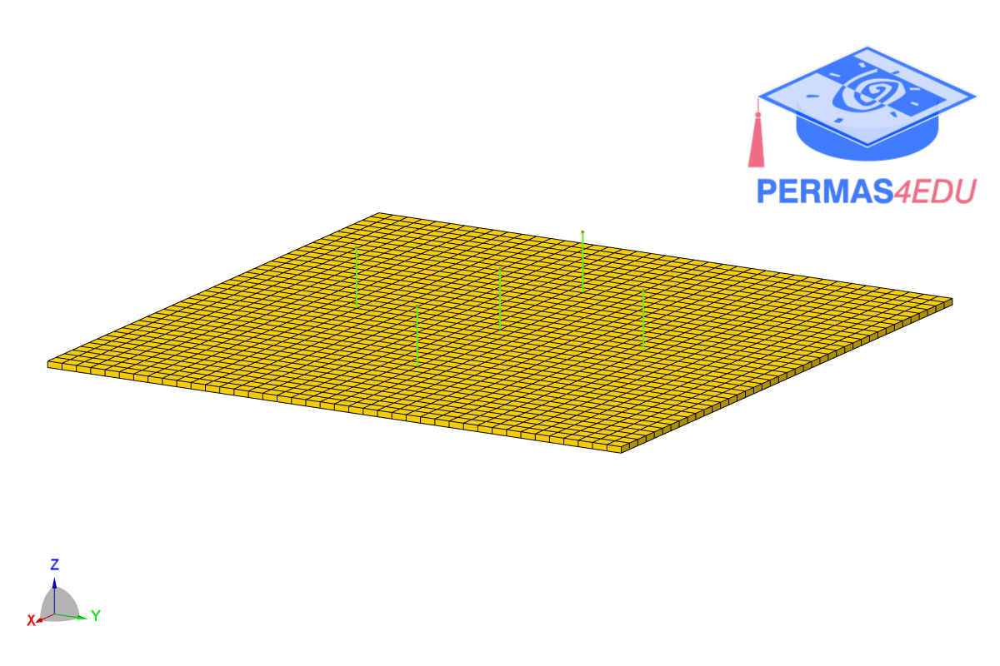

***
[⬅️](../060/README.md "Previous example")
[➡️](../062/README.md "Next example")
***
The example is adapted from [Continuous spatio-temporal surrogate of solid and fluid dynamics via Neural Differential Equations](https://doi.org/10.1016/j.ijmecsci.2026.111952)

