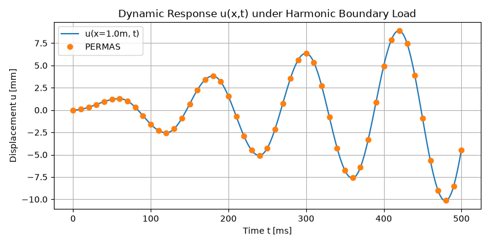

***
[⬅️](../063/README.md "Previous example")
[➡️](../README.md "Go up one directory level")
***
The example is adapted from [Time transient simulations via finite element network analysis: Theoretical formulation and numerical validation](https://doi.org/10.1016/j.mechrescom.2026.104790)

Thanks to Fabio Semperlotti for private communication.

## Case - 1

