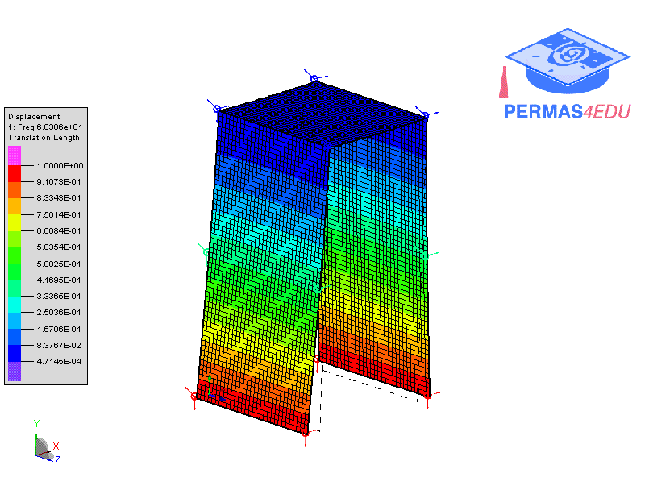

***
[⬅️](../001/README.md "Previous example")
[➡️](../003/README.md "Next example")
***

The example is adapted from [Reduction of the model prediction error in vibration-based SHM applications](https://doi.org/10.58286/29603)

