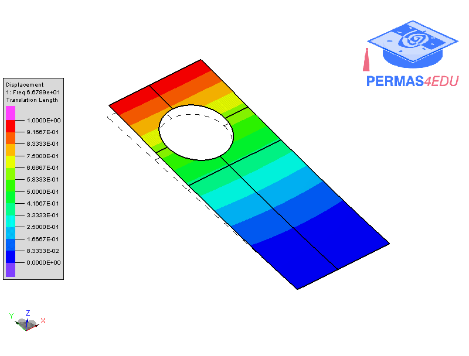
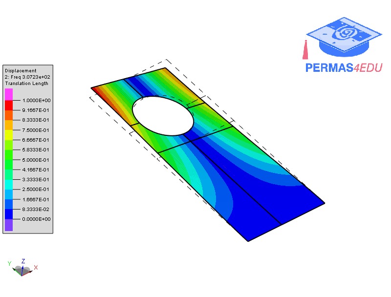
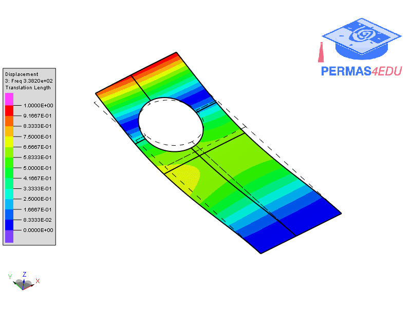
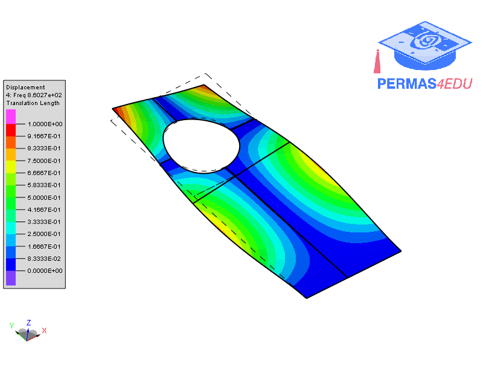

The examples are adapted from [An adaptive continuous scanning laser Doppler vibrometry technique for measuring vibrational mode shapes of structures with holes](https://dx.doi.org/10.1088/1361-6501/ad6630)

