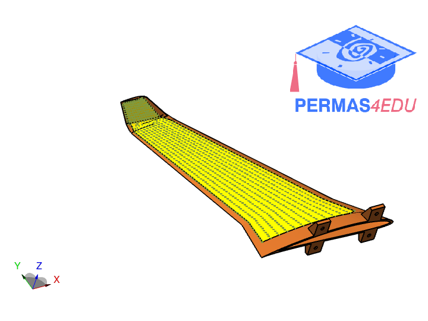
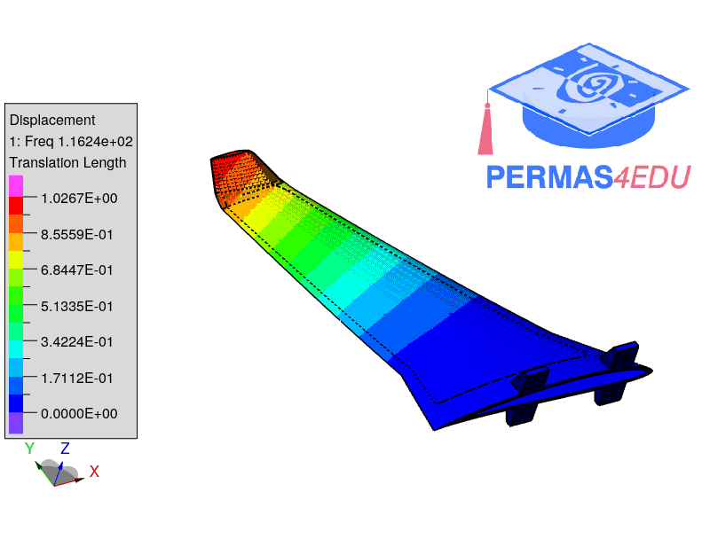
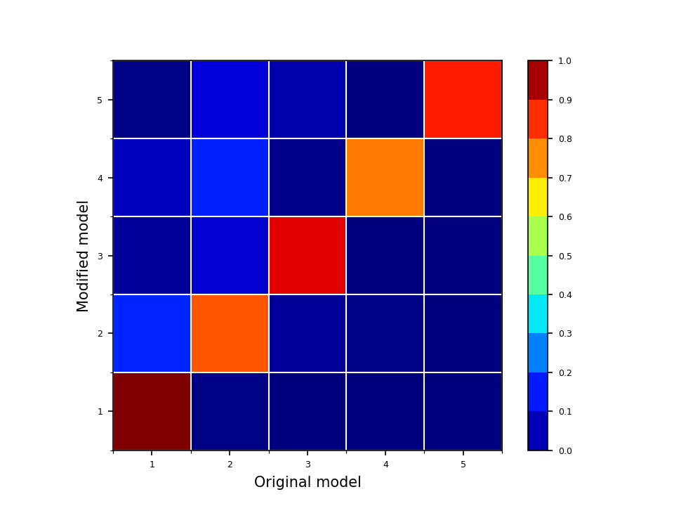

***
[⬅️](../004/README.md "Previous example")
[➡️](../006/README.md "Next example")
***

The example was provided by Florent Mathieu from [Eikosim](https://eikosim.com/en/eikosim-home-engineering-validation/). The mode shapes are extracted from digital image correlation ([DIC](https://eikosim.com/en/category/eikotwin-dic/)). His support is greatly appreciated.

