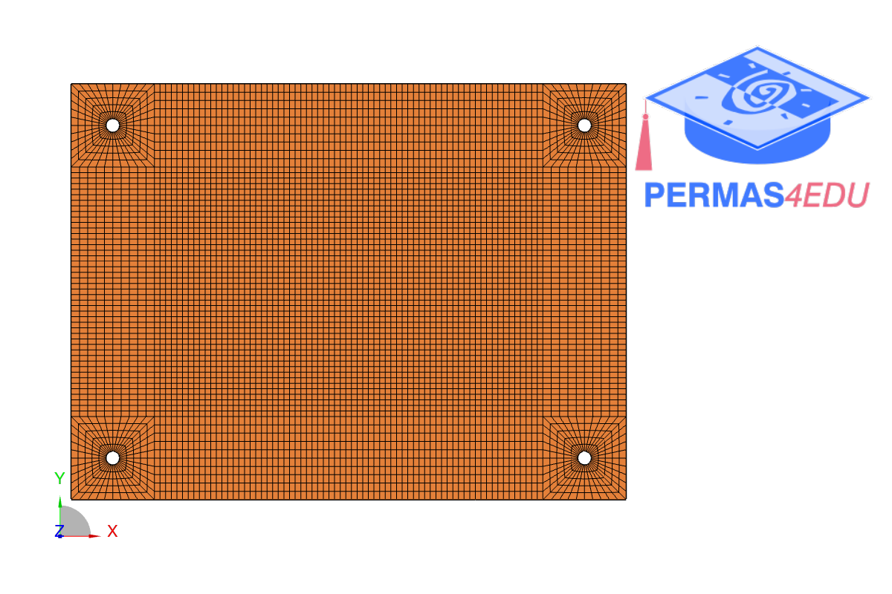
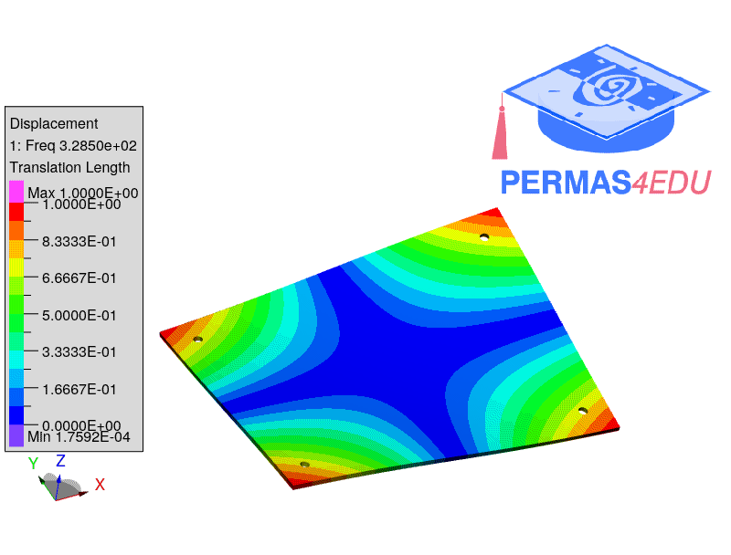
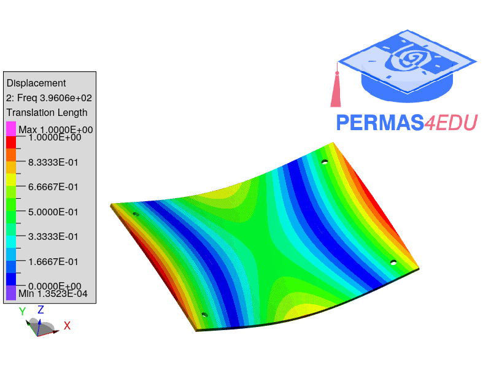
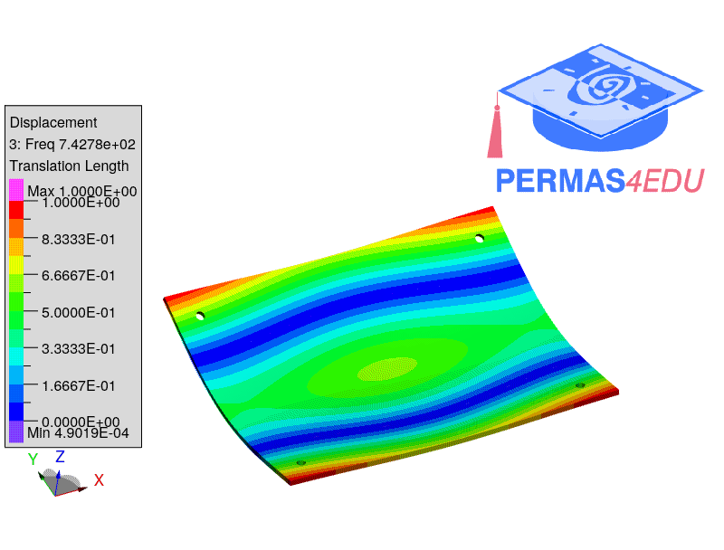
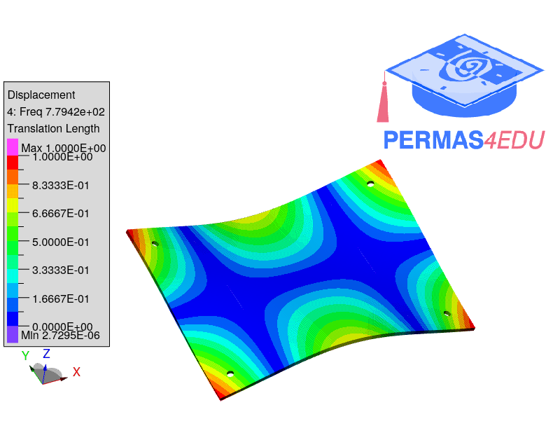
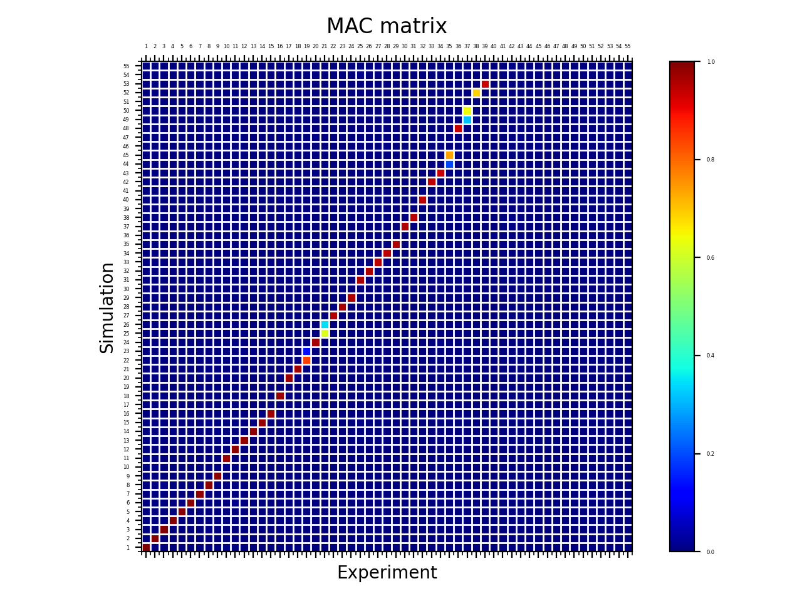

## Experimental setup

The test object is an aluminium plate ($$L=200$$ [mm], $$H=150$$ [mm], $$t=3$$ [mm]).
The circular holes at the 4 corners are each offset inwards by 15 mm from the side edges and have a diameter of 5 mm.
The aluminium plate is freely suspended from a frame and is excited by the automatic modal hammer SAM1. 
This short pulse excitation in the time domain leads to a broadband excitation in the frequency domain.
Small foam dampers are attached to the magnetic base stands to dampen the vibrations. 
These reduce the decay time of the plate without significantly influencing its vibration characteristics.
Both the frame and the magnetic feet are positioned on rubber feet or anti-slip mats to decouple the experimental setup from ambient vibrations.
The grid geometry of the plate is used both for the simulation and for the measurement with the Polytec Scanning Vibrometer (PSV-3D-Qtec). 
The three lasers of the measuring heads are superimposed at each measuring point, whereby the grid measuring points are recorded sequentially 
in order to determine the three-dimensional vibration vector at each point.

## Measurement data

The measurement data contains the spectra for each measurement point and the resulting mode shape. 
For comparison with the simulation, the modal parameters such as natural resonances and vibration modes are determined using modal analysis with the PolyWave software. 

## Results

## Finite element model

A structured mesh was used herein. The finite element model consists of 10545 QUAD4 elements and 10896 nodes.

## Modal correlation

$$MAC(i,j) = \frac{ |x_i^H y_j|^2 }{(x_i^H x_i) (y_j^H y_j)}, \quad 0 \le MAC(i,j) \le 1$$

## Conclusions

## Requirements

PERMAS V20 is needed for the computation of the MAC matrix using complex modes from experimental modal analysis (EMA).

## Acknowledgements

The pictures of the test setup and the results of the experimental modal analysis were kindly provided by Joline Dank (Polytec GmbH).
Further thanks go to her colleagues Jörg Sauer and Patric Gehring.
