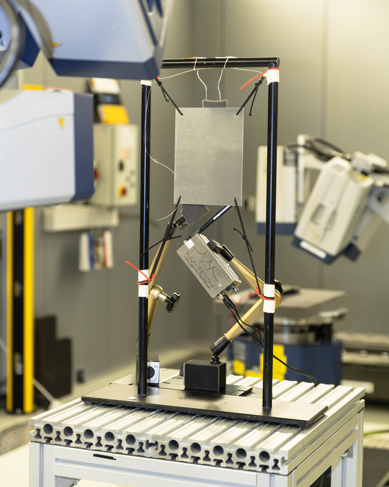

The pictures of the test setup and the results of the experimental modal analysis were kindly provided by Joline Dank (Polytec GmbH).
The test object is an aluminium plate that is supported by soft rubber bands.

