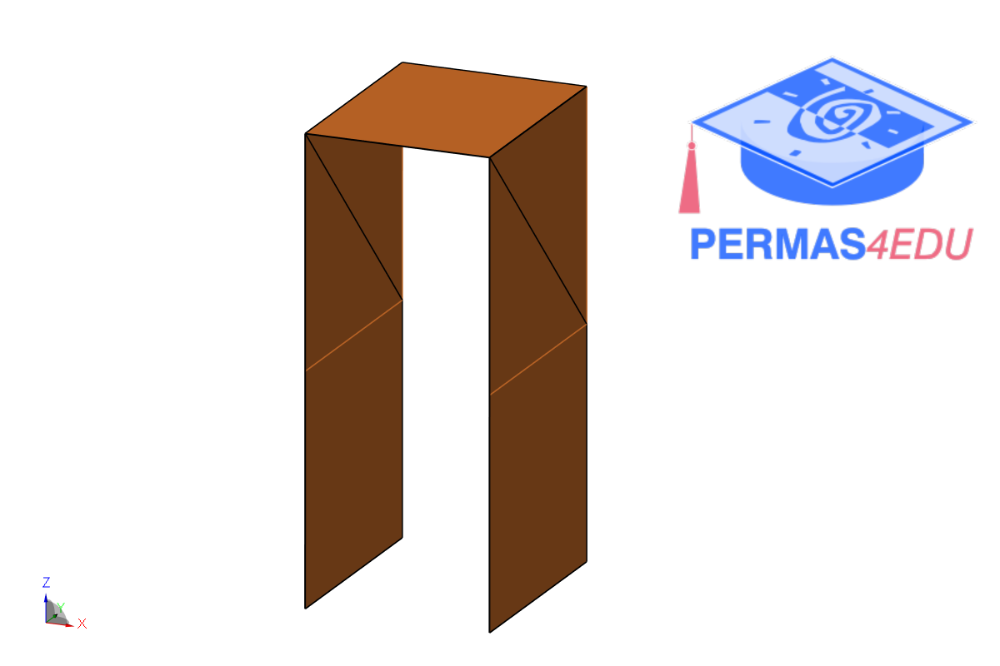
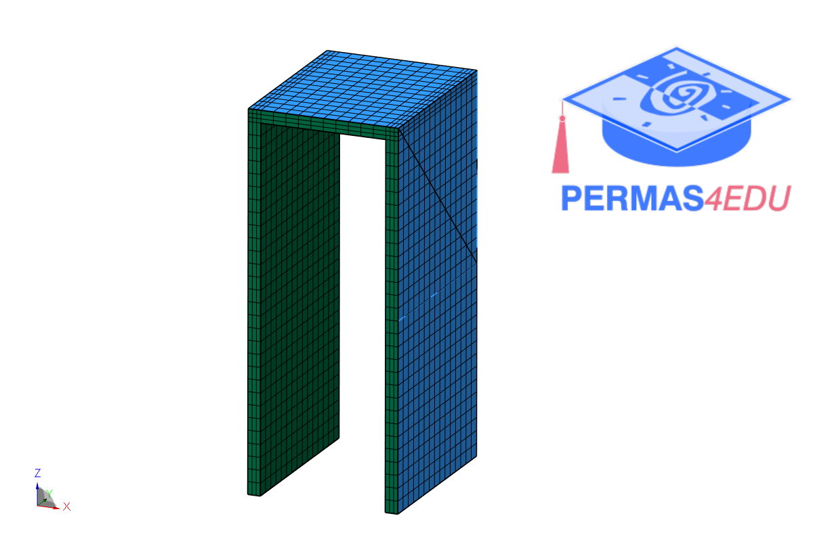

***
[⬅️](../006/README.md "Previous example")
[➡️](../008/README.md "Next example")
***

The measurement data were provided by Palle Andersen from the company [SVIBS](https://www.svibs.com). The mode shapes from the experimental modal analysis were extracted with ARTeMIS Modal.
His support is greatly appreciated.

 
