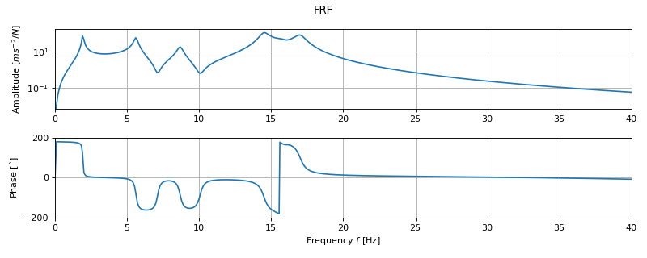

***
[⬅️](../008/README.md "Previous example")
[➡️](../010/README.md "Next example")
***

The example is adapted from [Variance estimation of modal parameters from the poly-reference least-squares complex frequency-domain algorithm](https://doi.org/10.1016/j.ymssp.2024.111905)

Thanks to Dmitri Tcherniak for private communication. His support is greatly appreciated.

