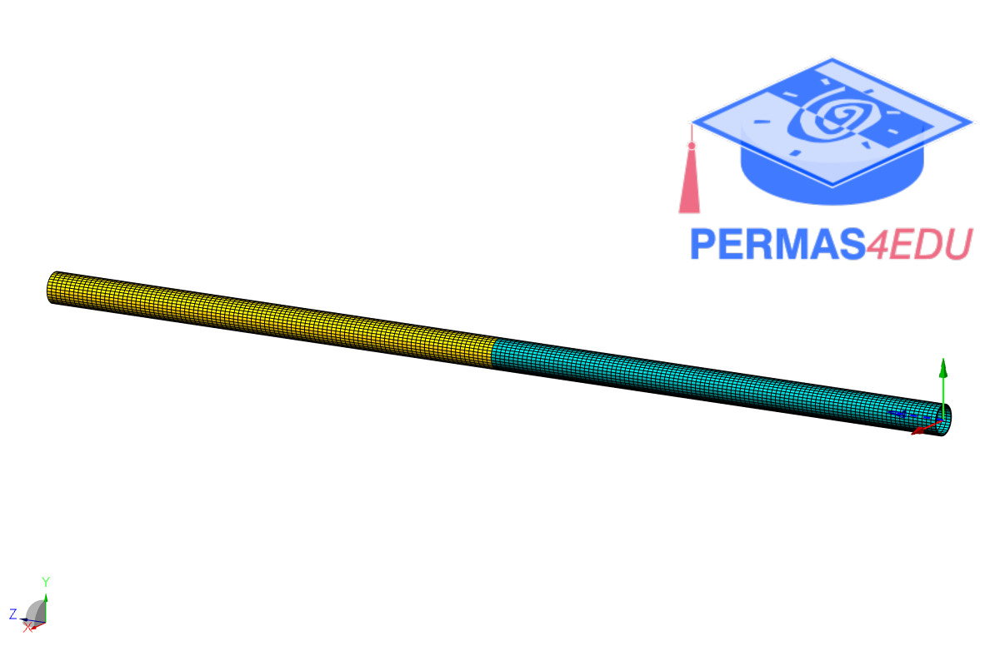
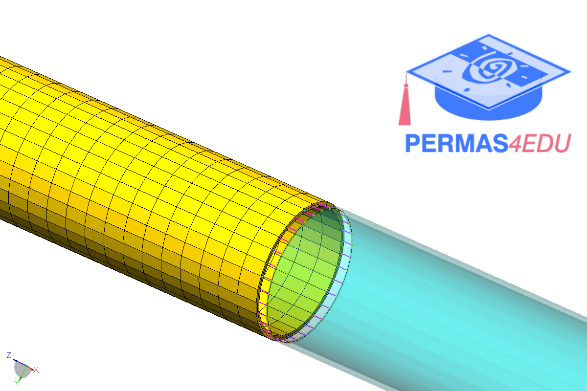

***
[⬅️](../009/README.md "Previous example")
[➡️](../011/README.md "Next example")
***

The example is adapted from [Finite Element Modelling and Updating of Welded Thin-Walled Beam](http://dx.doi.org/10.15282/ijame.15.4.2018.12.0449)

### Coincident nodes along the interface

### $MPC JOIN

