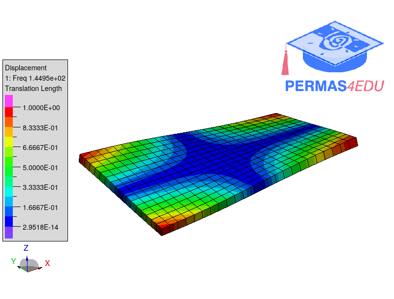

***
[⬅️](../010/README.md "Previous example")
[➡️](../012/README.md "Next example")
***

The example is adapted from [Test analysis verification using open software](http://www.sandv.com/downloads/1406bran.pdf).
Thanks to Anders Brandt for private communication.

