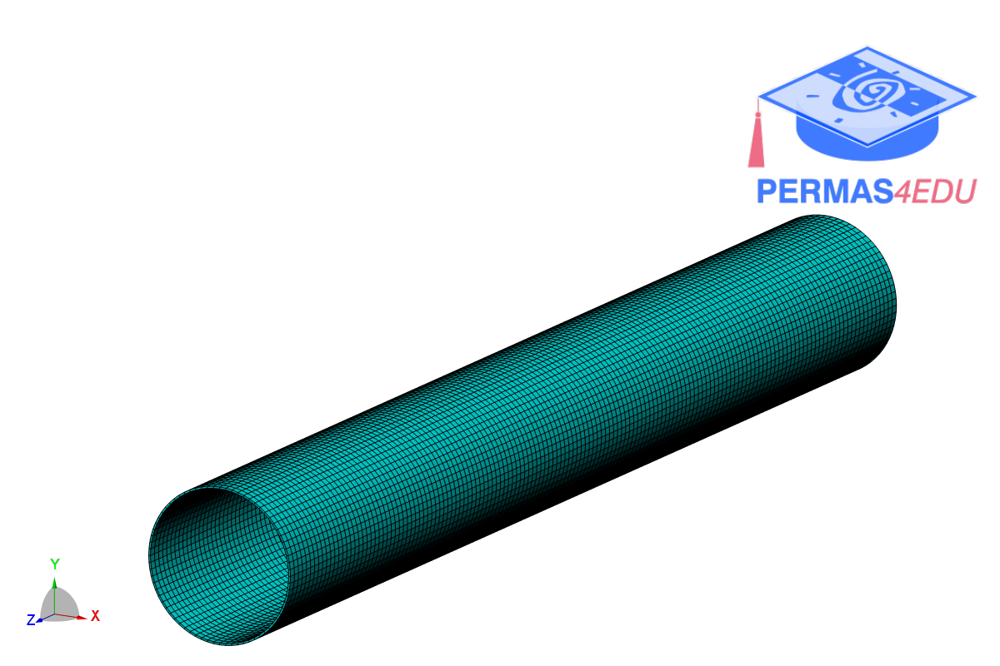

***
[⬅️](../013/README.md "Previous example")
[➡️](../README.md "Go up one directory level")
***

The example is adapted from [Finite Element Model Updating of Axisymmetric Structures](https://doi.org/10.3390/app152111407)

