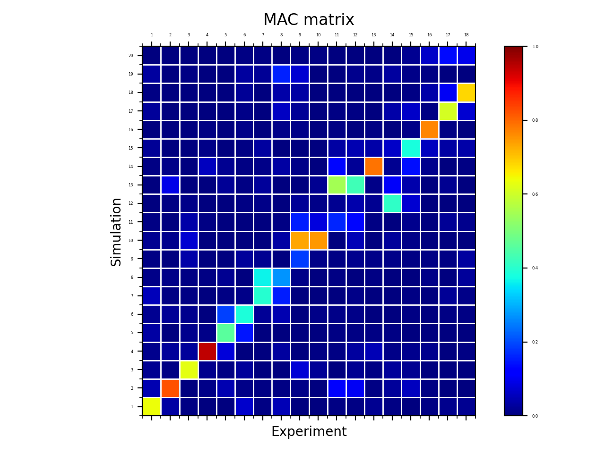

The example is adapted from [Making modal analysis easy and more reliable – Challenging AI-based algorithms with the BARC example](https://doi.org/10.13052/97887-438-0152-8_6)

Thanks to Haiko Brücher, Tim Kamper and Denis Beljan for sharing a corresponding CAD model, measurement data and an initial finite element model. Their support is greatly appreciated.

The measurement data was recorded using the Impact Testing Module in the ArtemiS Suite. The extraction of modal parameters was also performed using the modal analysis solution of ArtemiS Suite.
A [free trial licence](https://www.head-acoustics.com/modal-analysis) can be requested.

