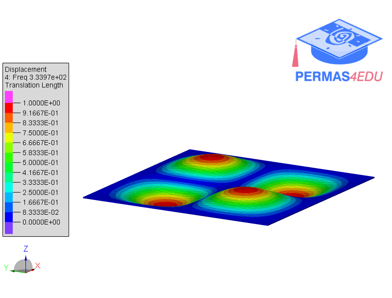
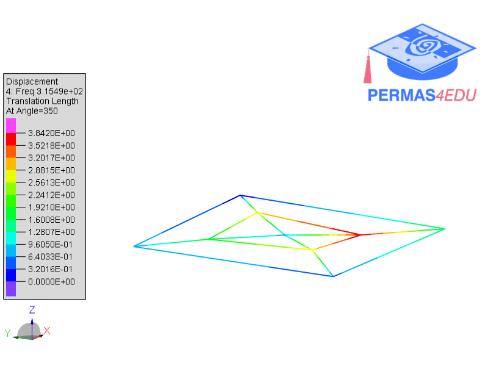
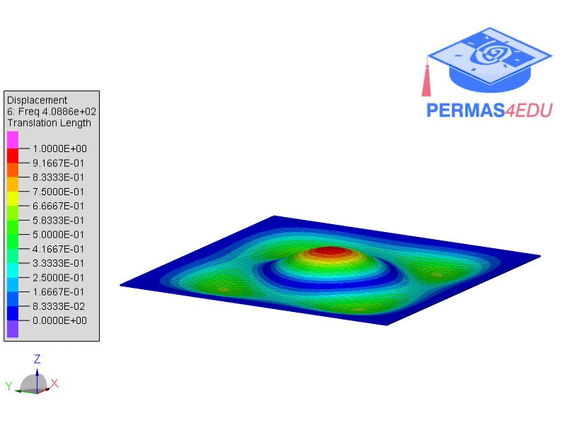

***
[⬅️](../015/README.md "Previous example")
[➡️](../017/README.md "Next example")
***

The example is adapted from [Mode-resolved, reconfigurable particle damping for printed circuit boards vibration control](https://doi.org/10.1016/j.ymssp.2026.113995).
Thanks to Kai Yang and Li-Qun Chen for sharing a finite element model and the results from experimental modal analysis. Their support is greatly appreciated.

