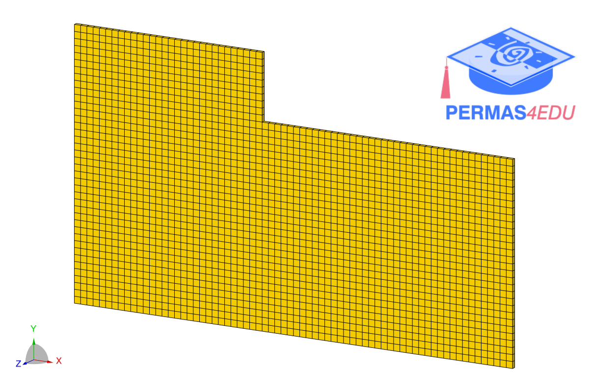
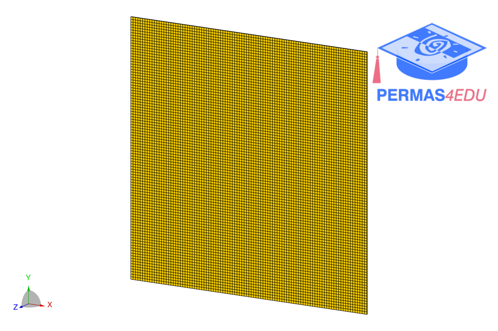

***
[⬅️](../016/README.md "Previous example")
[➡️](../018/README.md "Next example")
***

### L-shaped plate

The example is adapted from [Enhancing Structural Coupling: A Frequency-Based Methodology for Optimal Interface Expansion](https://doi.org/10.1016/j.jsv.2026.119782)

### Square plate

