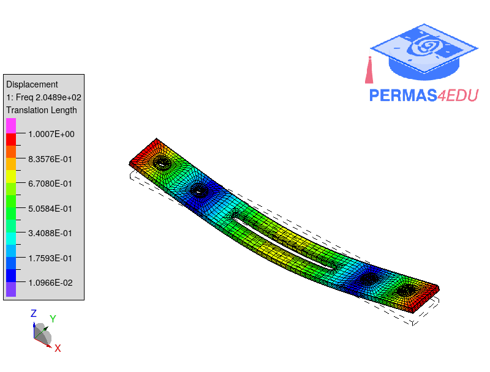
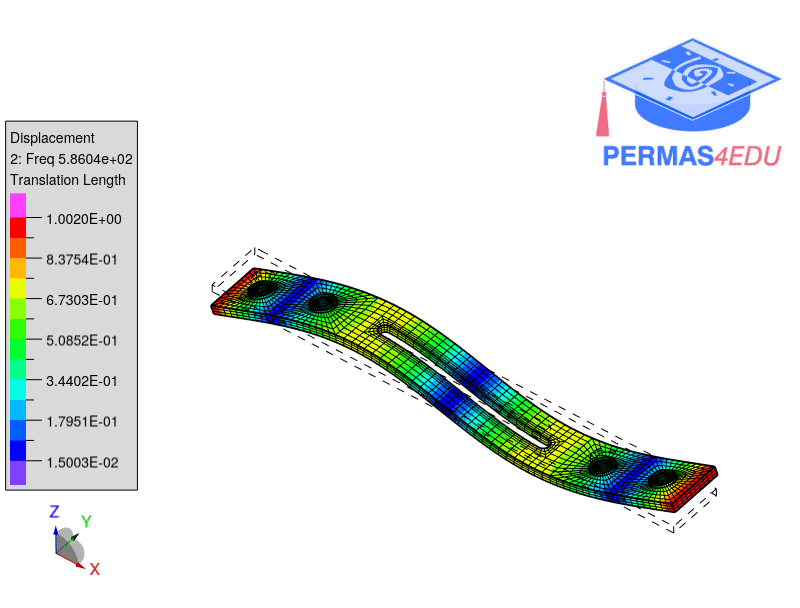

***
[⬅️](../020/README.md "Previous example")
[➡️](../README.md "Go up one directory level")
***

The example is adapted from [Variability in modal parameters identification using experimental modal analysis](https://doi.org/10.1063/5.0340796)

