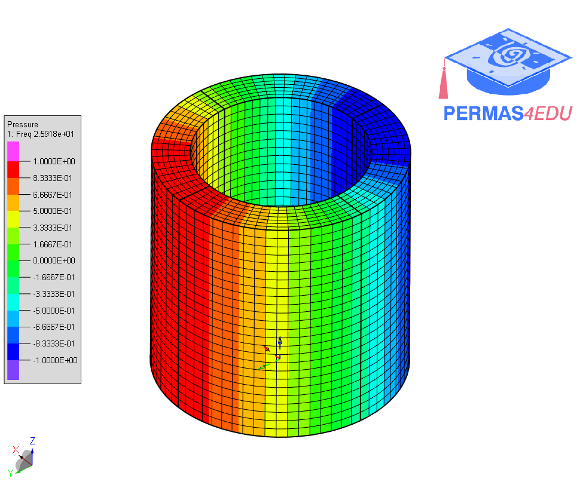
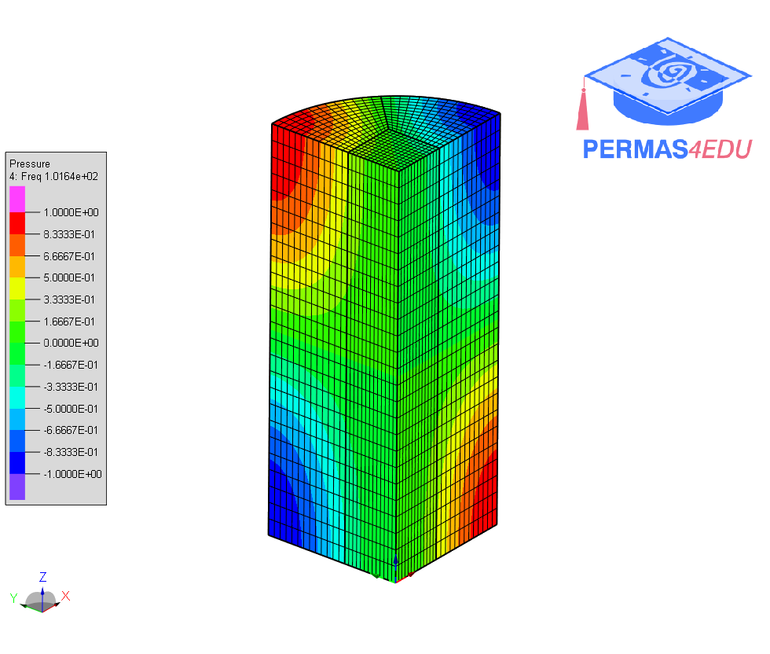
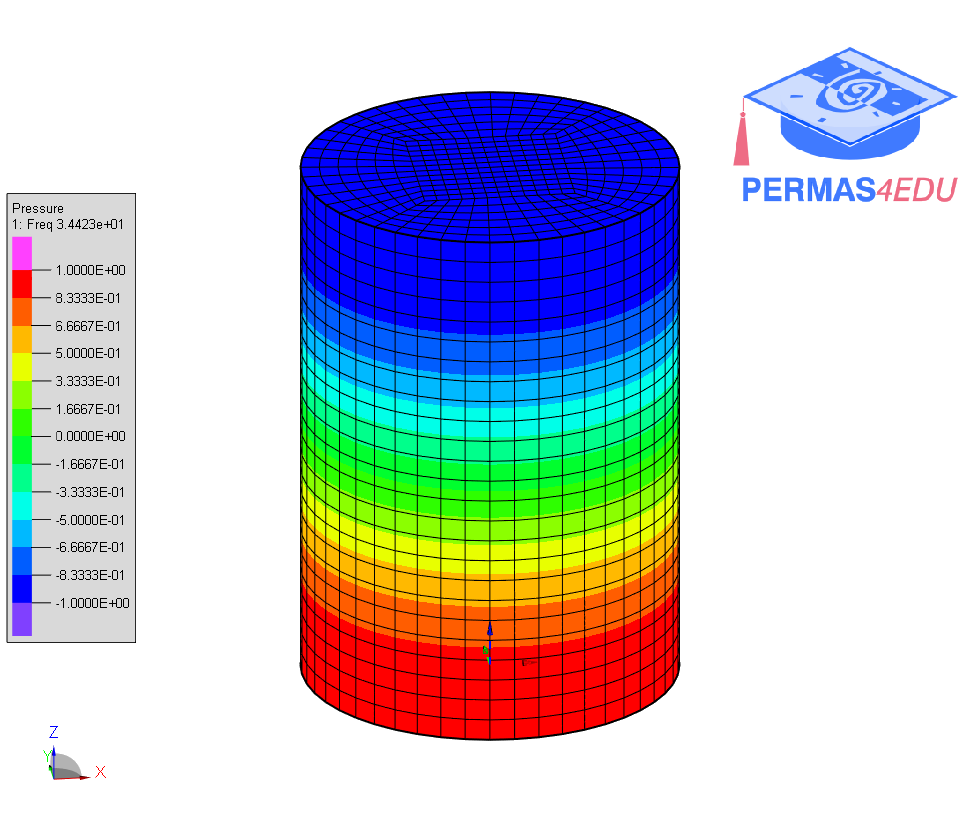

***
[⬅️](../001/README.md "Previous example")
[➡️](../003/README.md "Next example")
***

The example is adapted from [Dynamic stiffness formulations for exact modal and dynamic response analysis of three-dimensional acoustic cavities in cylindrical coordinates](https://doi.org/10.1016/j.jsv.2024.118397)

