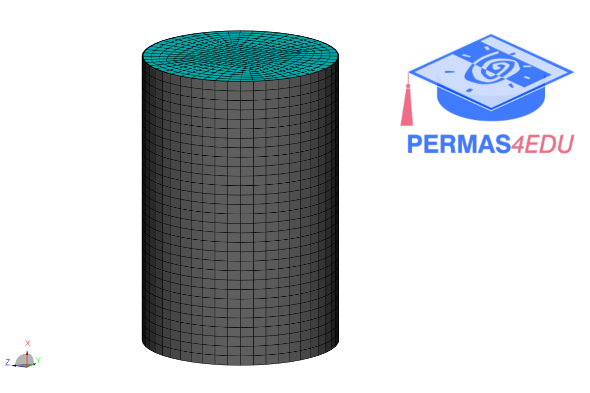

***
[⬅️](../003/README.md "Previous example")
[➡️](../README.md "Go up one directory level")
***

The example is adapted from [Free vibration analysis of a clamped cylindrical shell with internal and external fluid interaction](https://doi.org/10.1016/j.jfluidstructs.2024.104079)

