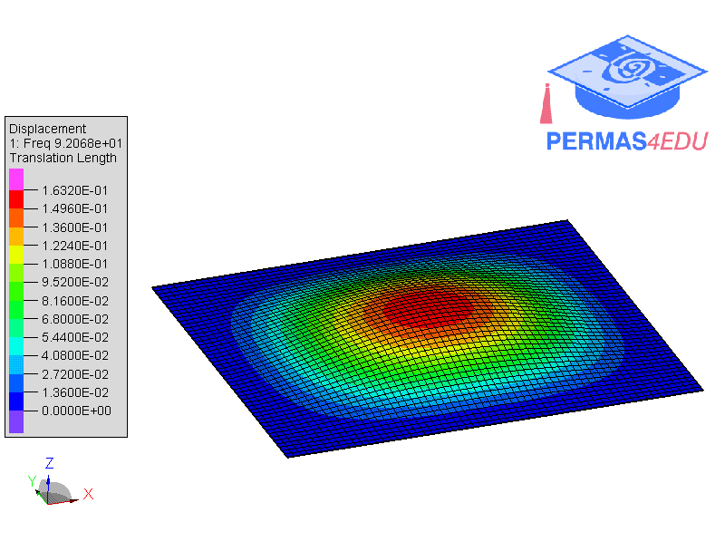

***
[⬅️](../004/README.md "Previous example")
[➡️](../README.md "Go up one directory level")
***

The example is adapted from [Analysis of sound radiation from a vibrating clamped thin rectangular plate without baffle and in the rigid baffle using exact formulas](https://doi.org/10.1016/j.wavemoti.2026.103704)

