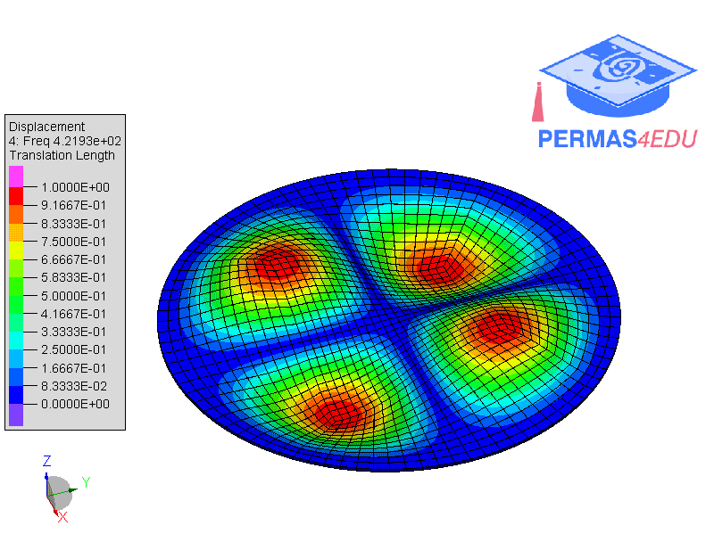

***
[⬅️](../006/README.md "Previous example")
[➡️](../README.md "Go up one directory level")
***

The example is adapted from [A novel hybrid spectral element-boundary element (SEM-BEM) method for the hydroelastic vibration analysis of shells in contact with fluid](https://doi.org/10.1016/j.tws.2026.114802)

### Square plate

### Circular plate

