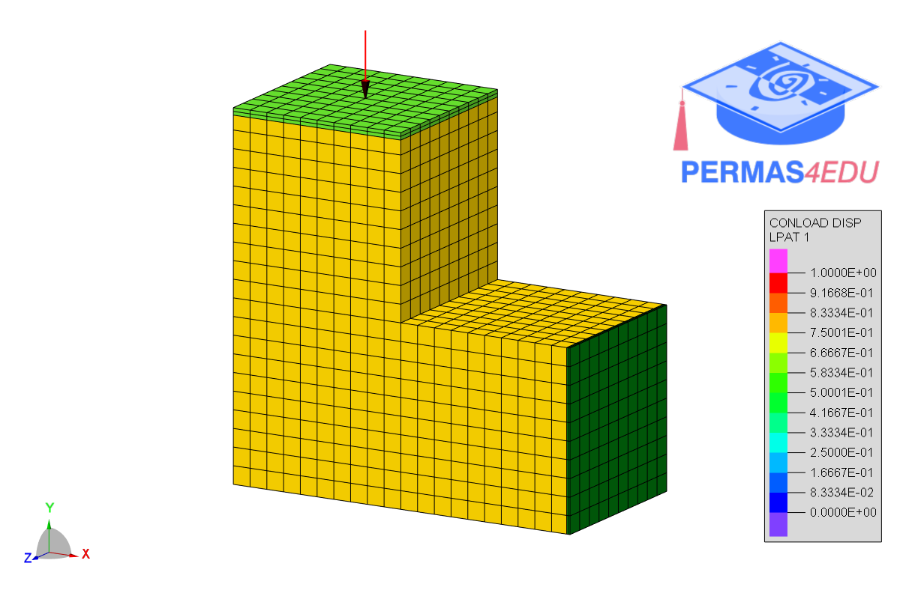

***
[⬅️](../007/README.md "Previous example")
[➡️](../README.md "Go up one directory level")
***

The example is adapted from [Surrogate-Based Uncertainty Quantification for Coupled Structural–Acoustic Problems](https://doi.org/10.3390/acoustics8020031)

