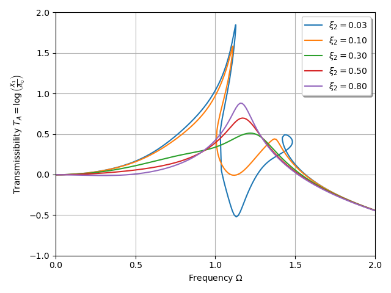

***
[⬅️](../003/README.md "Previous example")
[➡️](../005/README.md "Next example")
***

The example is taken from [Performance analysis and optimization of bimodal nonlinear energy sink](https://doi.org/10.1007/s11071-023-08737-8)

