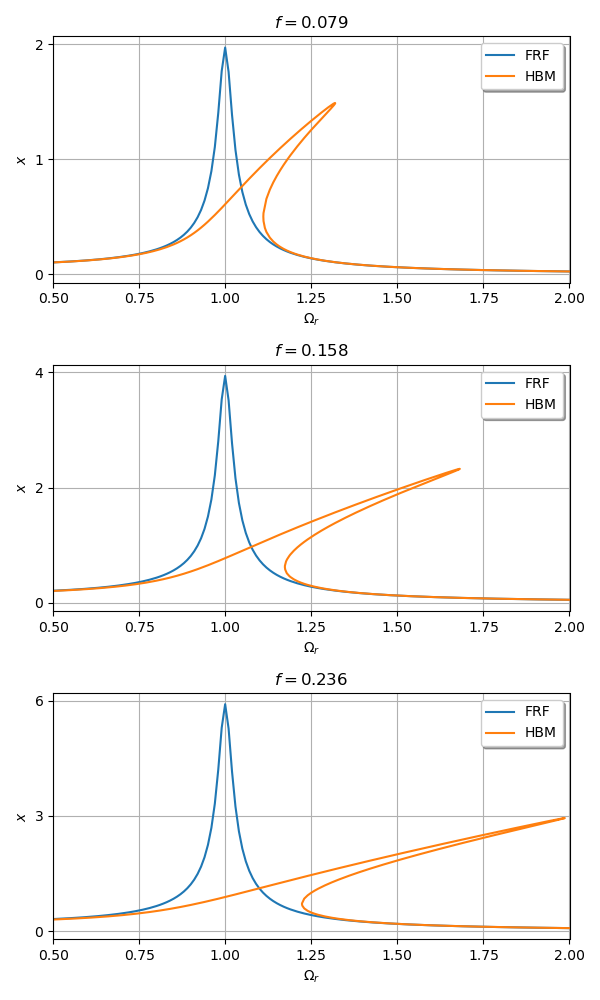

***
[⬅️](../004/README.md "Previous example")
[➡️](../006/README.md "Next example")
***

The example is taken from [Competitive advantages of a bistable vibration isolator: Cut-off frequency and operational safety near harmful resonance](https://doi.org/10.1016/j.jsv.2023.118004)

