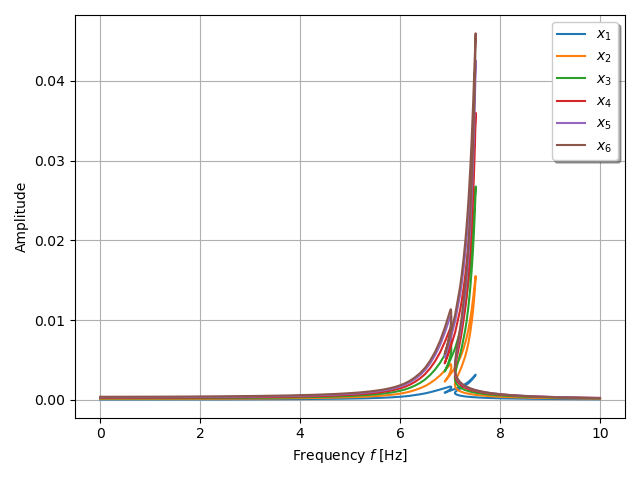

***
[⬅️](../005/README.md "Previous example")
[➡️](../007/README.md "Next example")
***

The example is taken from [A Lagrange surrogate-based approach for uncertain nonlinear oscillators](https://doi.org/10.1016/j.jsv.2021.116075)

