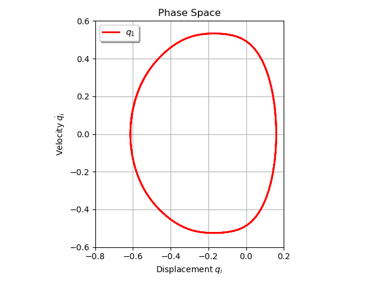

***
[⬅️](../007/README.md "Previous example")
[➡️](../009/README.md "Next example")
***

The example is taken from [Event-driven Gauss quadrature and stability analysis for fast alternating frequency–time harmonic balance of non-smooth systems](https://doi.org/10.1016/j.cnsns.2023.107189)

